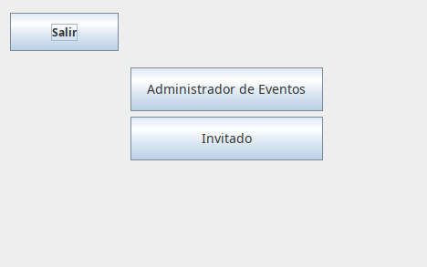
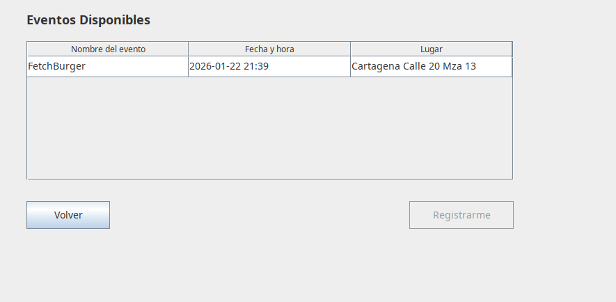

<div align="center">

# 📋 Gestión de Formularios

### Sistema de gestión de eventos y asistencia para SENA


[](https://maven.apache.org/)

[](LICENSE)


[Características](#-características-clave) • [Instalar](#-Descargar) • [Clonar](#-Clonar) • [Uso](#-uso-rápido) • [Tecnologías](#-tecnologías-utilizadas) • [Colaboradores](#-colaboradores)

</div>

---

## 📖 Descripción

**Gestión de Formularios** es una aplicación de escritorio desarrollada en Java que facilita la creación y administración de formularios de registro para eventos en el **Servicio Nacional de Aprendizaje (SENA)**.

## 🎯 Problemática

Actualmente en el SENA, los eventos presentan un problema de duplicación de trabajo:  el registro inicial se realiza mediante formularios digitales (como Google Forms), pero la toma de asistencia el día del evento se hace en papel.  Esto genera:

- ✘ Doble captura de datos (digital + papel)
- ✘ Retraso en la validación de asistencia
- ✘ Mayor probabilidad de errores humanos
- ✘ Tiempo excesivo de procesamiento para la oficina de bienestar

---

## 🚀 Características clave

-  **Sistema de roles** - Login para Administrador e Invitado
-  **Gestión completa de eventos** - Crear, modificar y eliminar eventos
-  **Registro detallado de asistentes** - Captura de datos completos
-  **Marcado de asistencia** - Sistema de checkbox con validación
-  **Exportación a Excel** - Reportes listos para análisis
-  **Notificaciones automáticas** - Recordatorios por correo (SMTP Gmail)
-  **Interfaz intuitiva** - Diseño amigable con Java Swing

---

## 🛠️ Tecnologías utilizadas

| Categoría | Tecnología | Versión |
|-----------|------------|---------|
| **Lenguaje** | Java | 19 |
| **Build Tool** | Maven | - |
| **Librería Office** | Apache POI | 5.5.1 |
| **Librería OOXML** | Apache POI OOXML | 5.5.1 |
| **GUI** | Java Swing | Nativa |
| **Tipo** | Aplicación de escritorio | JAR |

---

## 📁 Arquitectura y módulos

### Vista (Swing)
- `iLogin` - Pantalla de inicio y selección de rol
- `iAdminEvento` - Panel de administración de eventos
- `iInvitado` - Vista para usuarios invitados
- `iFormulario*` - Formularios de registro (Aprendiz/Externo)

### Servicios (Service Layer)
- `GestorEventos` - Lógica de gestión de eventos
- `GestorRegistros` - Control de registros y asistentes
- `NotificacionService` - Sistema de notificaciones
- `SchedulerService` - Programación de tareas automáticas
- `EmailService` - Envío de correos SMTP
- `ExportadorExcel` - Generación de archivos Excel

### Modelos (Domain)
- `Evento` - Entidad de evento
- `Registro` - Entidad de registro de asistente

---
# 📥 Descargar 

Puedes descargar la última versión desde la página de releases:

[](https://github.com/Louis-Du/GestionFormulario/releases/latest)

**Opciones de descarga:**
- 📦 **Source code (zip)** - Código fuente comprimido
- 📦 **Source code (tar.gz)** - Código fuente para Linux/Mac
- 💎 **GestionFormulario2-1.0-SNAPSHOT.jar** - Ejecutable JAR (si está disponible)

---

## 📥 Ejecutar

### Requisitos previos

Asegúrate de tener instalado: 

- ☕ **Java JDK 19** o superior - [Descargar](https://www.oracle.com/java/technologies/downloads/#java19)
- 📦 **Maven 3.6+** - [Descargar](https://maven.apache.org/download.cgi)
- 📧 **Cuenta Gmail** (para configurar SMTP y envío de correos)

### Pasos de instalación

1. **Clonar el repositorio**
```bash
git clone https://github.com/Louis-Du/GestionFormulario.git
cd GestionFormulario
```

2. **Compilar el proyecto**
```bash
mvn clean package
```

3. **Ejecutar la aplicación**
```bash
java -jar target/GestionFormulario2-1.0-SNAPSHOT.jar
```

**Alternativa:** Abrir el proyecto en tu IDE favorito (NetBeans, IntelliJ IDEA, Eclipse) y ejecutar la clase principal.

---

## 🎮 Uso rápido

### Flujo básico

1. **Abrir la aplicación** y seleccionar tu rol (Administrador/Invitado)
2. **Crear un evento** (solo Administrador)
   - Ingresar nombre, fecha, lugar y código de asistencia
3. **Compartir el formulario** con los participantes
4. Los participantes **completan su registro**
5. **Marcar asistencia** el día del evento usando el código
6. **Exportar los datos** a Excel para generar reportes

### Capturas de pantalla

Descomentar cuando agregues las imágenes: 
#### Pantalla de Login


#### Panel de Invitado


#### Formulario de Registro


---

## 📝 Licencia

Este proyecto está bajo la Licencia MIT.  Consulta el archivo `LICENSE` para más detalles.

---

## 👥 Colaboradores

<table>
  <tr>
    <td align="center">
      <a href="https://github.com/eljavi0">
        <br />
        <sub><b>eljavi0</b></sub>
      </a><br />
      <sub>Desarrollador</sub>
    </td>
    <td align="center">
      <a href="https://github.com/Louis-Du">
        <br />
        <sub><b>Louis-Du</b></sub>
      </a><br />
      <sub>Desarrollador</sub>
    </td>
    <td align="center">
      <a href="https://github.com/lukasa133">
        <br />
        <sub><b>lukasa133</b></sub>
      </a><br />
      <sub>Desarrollador</sub>
    </td>
  </tr>
</table>

---

<div align="center">

**⭐ Si este proyecto te fue útil, considera darle una estrella en GitHub ⭐**

</div>
